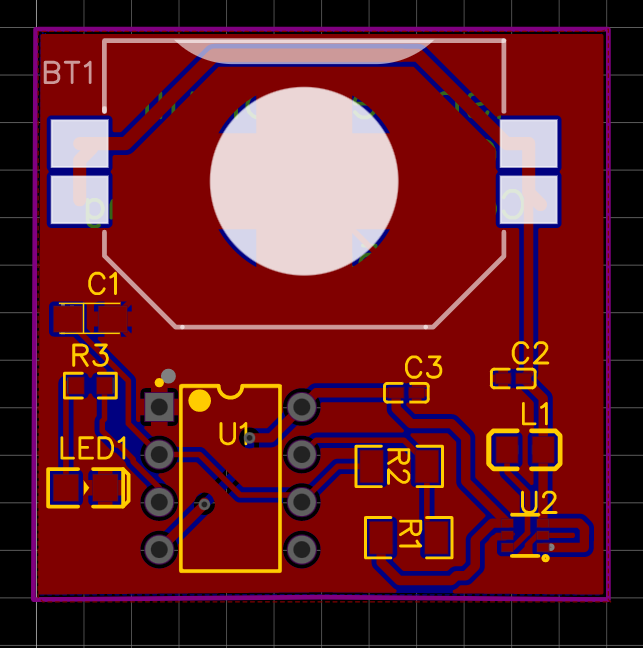
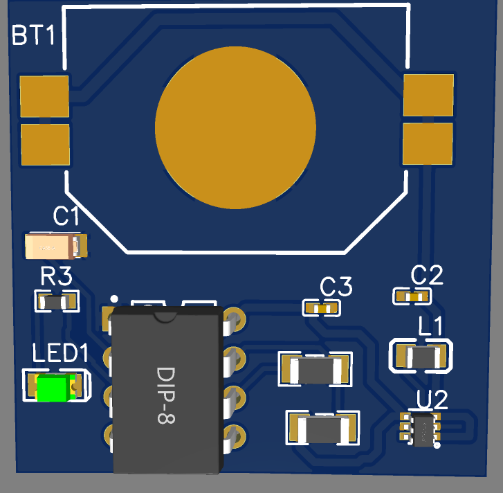
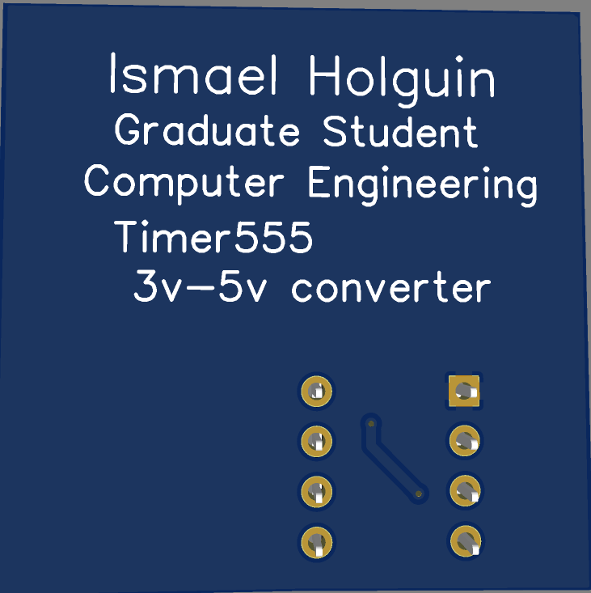

# Timer555 with 3v to 5v DC boost converter
The circuit triggers the LED after 683ms and stays on for 1018ms and has frequency of .58Hz

# Images

* Circuit Schematic
  
     
     

* Layout
     

* 3D view    
     
     